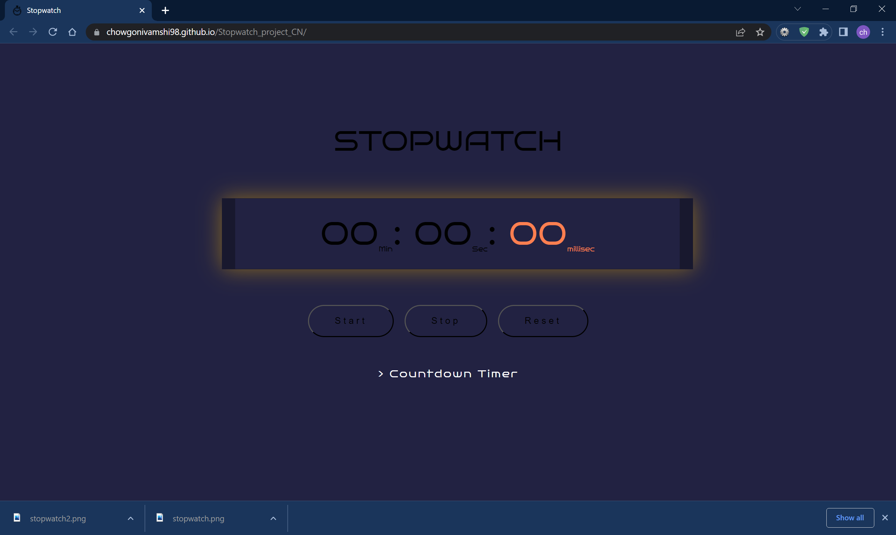

# Stopwatch Project
* Creating Stopwatch  using HTML CSS, and JavaScript.
* Our StopWatch will have the functionality of Start, Stop, and Reset.
## Approach :
* Create div container in which all the elements are present.
* Inside this container add another div  that contain all time elements like an  minutes, seconds, and milliseconds, 3 buttons for start, stop, and reset.
* Now  add a External  Css file to Style the document.
* Now add a JavaScript file in which add onclick functions on all three buttons and create another function in which write all the logical code and add value to corresponding minutes, seconds, milliseconds.
From the above approach the page looks like below image:

